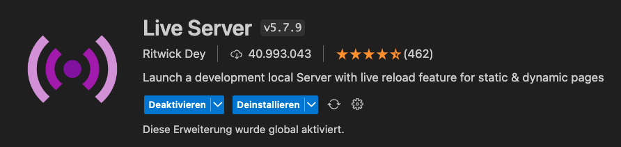
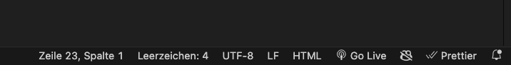

# Quiz-App

Mit dieser Quiz-App kannst du spielend ein Multiple-Choice-Quiz erleben. 

## So legst du los

Folge diesen einfachen Schritten, um das Quiz zu starten:

### Schritt 1: Repository klonen

Klone das Repository auf deinen Computer mit:

```bash
git clone https://github.com/maidalisic/Sumary-Betriebssysteme.git
```

### Schritt 2: In Visual Studio Code öffnen

Öffne den geklonten Ordner in Visual Studio Code.

### Schritt 3: Live Server Extension installieren

Installiere die "Live Server" Extension in Visual Studio Code, damit du das Quiz auf einem lokalen Server laufen lassen kannst. Die Extension findest du im Extensions-Marktplatz von Visual Studio Code.



### Schritt 4: Projekt starten

1. Öffne die `index.html` Datei in Visual Studio Code.
2. Klicke mit der rechten Maustaste auf den Code oder den Tab und wähle `Open with Live Server`, oder klicke auf den "Go Live"-Button unten in der Statusleiste, um den Server zu starten.



Dein Standardbrowser sollte sich nun automatisch öffnen und dir die Quiz-App zeigen.